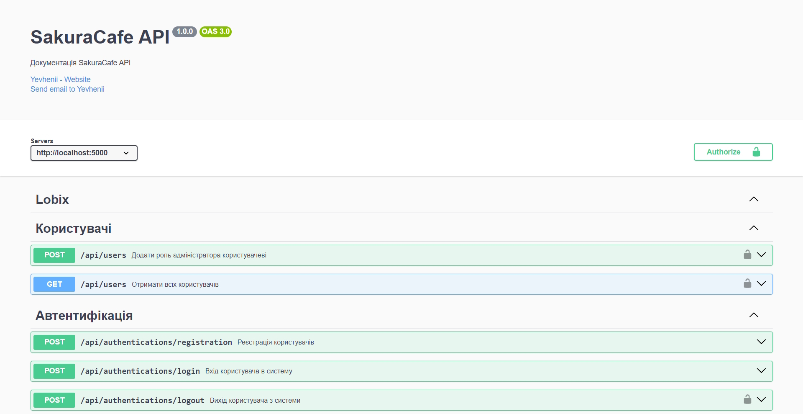

# SakuraCafe API



## Overview

Welcome to SakuraCafe API, the server-side component of the SakuraCafe website, a Japanese cuisine cafe. This API, built with NestJS, provides a comprehensive set of features for user authentication, role management, and CRUD operations for managing categories, food items, ingredients, and orders. Utilizing technologies like JWT, TypeORM, and PostgreSQL, SakuraCafe API ensures secure and efficient operation.

## Features

### User Authentication

SakuraCafe API provides a seamless user authentication experience, ensuring the security and integrity of user accounts. Users can register, login, and logout with ease. Upon registration, users receive a confirmation email containing an activation link to activate their accounts. This email-based account activation process adds an extra layer of security, ensuring that only verified users can access the platform. Passwords are securely hashed using bcrypt for enhanced protection. In case of incorrect login credentials, users receive clear error messages, maintaining a user-friendly authentication flow. Additionally, the API supports token-based authentication using JWT tokens, with access and refresh tokens employed to manage user sessions securely.

### Role Management

The API implements a role-based access control system with three distinct roles: `ghost`, `user`, and `admin`. Users start as `ghost` upon registration and must activate their accounts through email confirmation to become `user`. Administrators have elevated privileges, enabling them to manage content, approve or reject user orders, and assign admin roles to other users.

### RESTful API and CRUD Operations

SakuraCafe API provides a RESTful interface for seamless integration with frontend applications. It supports full CRUD (Create, Read, Update, Delete) operations for managing categories, food, ingredients, trays and orders. This enables smooth management of content and orders, ensuring a streamlined user experience.

### Ratings

The API also supports the management of ratings for food items. Users can create new ratings, delete existing ones, and retrieve all ratings submitted by a specific user. This feature allows users to provide feedback on food items, contributing to the overall dining experience.

### API Documentation with Swagger

SakuraCafe API includes Swagger documentation for easy exploration of available endpoints and interaction with the API. Swagger documentation is provided in Ukrainian to cater to Ukrainian-speaking users, ensuring accessibility and clarity for a wider audience. You can access the API documentation at `http://localhost:5000/api/docs` after starting the server.

### Guards and Pipes

SakuraCafe API utilizes guards and pipes for request validation and authorization control.

- **Admin Guard**: Protects routes that require admin privileges. Users must have the `admin` role to access these routes.
- **User Guard**: Ensures that only authenticated users (excluding `ghost` users) can access certain routes.
- **Validation Pipe**: Validates incoming request payloads using class-validator and class-transformer. It ensures that request data meets the specified validation rules, preventing invalid data from reaching the controllers.
- **File Validation Pipe**: Specifically designed for validating uploaded files, this pipe checks file size, MIME type, and other criteria to ensure that only valid files are accepted.

## Technologies Used

- **NestJS**: Framework for building efficient and scalable server-side applications.
- **TypeORM**: ORM for TypeScript and JavaScript to work with databases.
- **PostgreSQL**: Powerful, open-source relational database system.
- **JWT**: JSON Web Tokens for secure authentication and authorization.
- **Nodemailer**: Module for sending emails from Node.js applications.
- **Swagger**: Tool for documenting and interacting with RESTful APIs.
- **bcrypt**: Library for hashing passwords.
- **cors**: Middleware for enabling Cross-Origin Resource Sharing.
- **uuid**: Library for generating universally unique identifiers.
- **rxjs**: Library for reactive programming using Observables.
- **dotenv**: Module for loading environment variables from a .env file.

## Getting Started

To get started with SakuraCafe API, follow these steps:

1. **Clone the Repository**: Clone the SakuraCafe API repository to your local machine.

   ```bash
   git clone https://github.com/GamesFire/sakura-cafe-api.git
   ```

2. **Install Dependencies**: Navigate to the project directory and install dependencies using npm or yarn.

   ```bash
   cd sakura-cafe-api
   npm install
   ```

3. **Set Up Environment Variables**: Configure environment variables for database connection, email service, JWT secret, and other settings as needed. You can use a `.env` file for local development.

4. **Start the Server**: Start the SakuraCafe API server in development mode.

   ```bash
   npm run start:dev
   ```

5. **Explore the API Documentation**: Access the Swagger documentation at `http://localhost:5000/api/docs` to explore the available endpoints and interact with the API.

## Contributing

Contributions to SakuraCafe API are welcome! Feel free to submit bug reports, feature requests, or pull requests to help improve the API.
